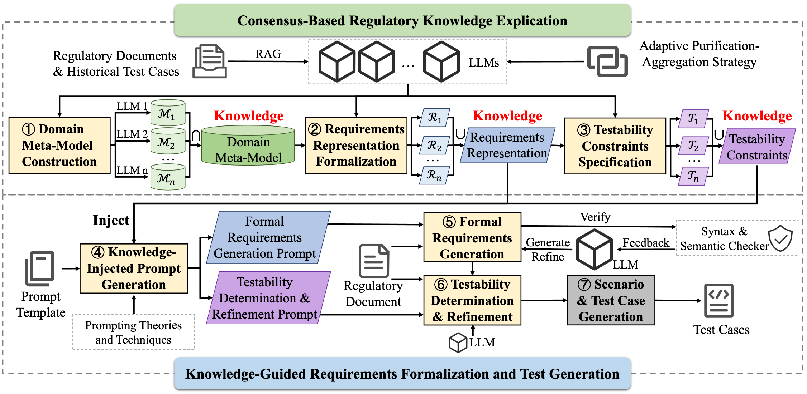

# RAFT

RAFT is a framework for automated requirement formalization and compliance test generation. It is the official implementation for paper [Explicating Regulatory Knowledge from LLMs to Auto-Formalize Requirements for Compliance Test Case Generation](). RAFT first explicates tacit regulatory knowledge from multiple LLMs using an Adaptive Purification-Aggregation strategy and consolidates it into a domain meta-model, a formal requirement representations, and testability constraints. These artifacts are dynamically injected into prompts to guide high-precision formalization and automated test generation. Experiments on financial, automotive, and power system regulations show that RAFT achieves expert-level performance while significantly reducing generation and review effort.





## 1 Code, Prompts, Datasets, Anonymized Ground-Truth, and Results

The `data/` directory contains necessary resources for understanding the RAFT framework, including evaluation datasets, prompt templates, and example inputs/outputs.

As stated in the Data Availability statement, our code, prompts, datasets, anonymized ground-truth, and results are publicly available in this repository. Their locations are:

| Artifact | Location |
| --- | --- |
| **Code** | Repository root and modules: `main.py`, `trl/`, `testcase/`, `testability/`, and `experiment/` |
| **Prompts** | `data/input_prompt/` (framework prompt templates) and `experiment/exp*/prompt/` (per-experiment prompts) |
| **Datasets** | `data/evaluation_dataset/` (regulatory rule documents, grouped by experiment) |
| **Anonymized Ground-Truth** | `data/evaluation_dataset/*/testcase/` (ground-truth test cases), plus `data/evaluation_dataset/*/business_scenario/` (ground-truth business scenarios) |
| **Results** | `experiment/exp*/` (per-method result folders and generated `fig/` tables and figures) |

The remainder of this section details the contents of the `data/` directory.

### 1.1 Evaluation Datasets (`evaluation_dataset/`)
The evaluation datasets are grouped by experiment (`exp1/`, `exp3/`, `exp5/`), covering 11 regulatory documents from various domains (stock exchanges, bond trading, margin trading, automotive, and power systems).
- **exp1/rule/dataset*.pdf|txt** and **exp5/rule/dataset*.pdf**: Regulatory rule documents, in PDF or plain text format.
- **exp1/testcase/dataset*.json** and **exp5/testcase/dataset*.json**: Ground-truth test cases corresponding to each regulatory document, used for evaluating test case generation performance.
- **exp1/business_scenario/dataset*.txt** and **exp5/business_scenario/dataset*.txt**: Ground-truth business scenarios, used for evaluating business scenario coverage.
- **exp3/dataset.json**: Step-level evaluation dataset, where each element provides a regulatory `rule`, its formal `requirements` representation, and a `testability` label.

### 1.2 Input: Prompt Templates (`input_prompt/`)
- **meta_model_generation.md**: Detailed prompt template for generating domain meta-models. Specifies the two-step construction process: (1) extract and confirm rule elements, (2) build a three-layer meta-model structure (Rule -> Precondition/Operation/ExpectedResult -> leaf elements).
- **requirement_generation.md**: Prompt template for generating structured requirements from regulatory rules.
- **testable_requirement_representation_generation.md**: Prompt template for generating testable requirement representations, leveraging the previously generated meta-model.
- **document.txt**: Example regulatory document containing excerpts from the Shenzhen Stock Exchange Bond Trading Rules. Used as input for meta-model and requirement representation generation.
- **testcase.json**: Example test cases in JSON format, used as reference for knowledge extraction.

### 1.3 Output: Knowledge Artifacts (`knowledge/`)
- **meta_model_*.puml**: Domain meta-models generated by different LLMs (DeepSeek, GPT, Grok) in PlantUML format. The meta-model follows a three-layer structure: top layer (Rule) -> middle layer (Precondition, Operation, ExpectedResult) -> bottom layer (rule elements).
- **testable_requirement_representation_*.txt**: Testable requirement representations generated by different LLMs. These representations formalize regulatory rules into a structured format that can be directly used for test case generation.

### 1.4 Output: Test Case Generation (`requirement_testcase/`)
- **dataset.pdf**: Input regulatory document (PDF format) for test case generation.
- **formal_requirements.json**: Raw formal requirements generated by the framework.
- **formal_requirements_postprocess.json**: Post-processed formal requirements with improved structure and readability.
- **testcase.json**: Final output file containing generated test cases for the input regulatory document.

### 1.5 LLM API Configuration
- **api_config.json**: Configuration file for LLM API services. Contains `base_url`, `api_key`, and `model` fields. Users need to fill in their actual API credentials before running the framework.


## 2 Installation
All experiments and the following steps are conducted on Ubuntu:22.04

1. Install dependencies.

    ```bash
    sudo apt update
    sudo apt upgrade -y
    sudo apt install build-essential zlib1g-dev libbz2-dev libncurses5-dev libgdbm-dev libnss3-dev libssl-dev libreadline-dev libffi-dev
    sudo apt-get install -y libgl1-mesa-dev
    sudo apt-get install libglib2.0-dev
    sudo apt install wget
    sudo apt install git
    ```

2. Install miniconda.

    ```bash
    cd ~
    wget https://repo.anaconda.com/miniconda/Miniconda3-latest-Linux-x86_64.sh
    bash Miniconda3-latest-Linux-x86_64.sh
    source ~/.bashrc
    ```

3. Create a virtual python environment and install the required dependencies.
    ```bash
    git clone https://github.com/1767675261/RAFT.git
    cd RAFT
    conda create -n RAFT python=3.10
    conda activate RAFT
    pip install -r requirements.txt
    pip install -e .
    ```

4. Download necessary LLMs.

    ```bash
    git lfs install
    git clone https://huggingface.co/a1767675261/RAFT
    mkdir model
    cp -r RAFT/* model/
    rm -rf RAFT
    ```


## 3 Usage

We provide interface for Regulatory Knowledge Explication and Test Case Generation:

```
python main.py --task {TASK} --document {DOC} --testcase {TC}
```

TASK can be `meta_model_gen` for meta model generation, `requirement_representation_gen` for testable requirement representation generation, or `testcase_gen` for test case generation.

If TASK is `meta_model_gen` or `requirement_representation_gen`, DOC is the path to the regulatory document file used for RAG (e.g., `data/input_prompt/document.txt`), and TC is the path to the testcase file used for RAG (e.g., `data/input_prompt/testcase.json`). 

If TASK is `testcase_gen`, DOC is the path to the regulatory document file used for testcase generation input (e.g., `data/requirement_testcase/dataset.pdf`), and TC is the path to the testcase file used for testcase generation output (e.g., `data/requirement_testcase/testcase.json`).

**Note:** Before running the above command, please make sure to set your `base_url`, `model`, and `api_key` in the config file `data/api_config.json`.


## 4 Experiments

We provide scripts to reproduce the main experiments in the paper. Please refer to the `experiment/` folder for more details.

### 4.1 Experiment I: Overall Performance

- Dataset and Experimental Results:
    - Dataset: `exp1/dataset/`
    - Ground Truth Test Cases: `exp1/testcase/`
    - Ground Truth Business Scenarios: `exp1/requirement/`
    - RAFT Results: `exp1/{llm}_ours`
    - Expert Results: `exp1/expert`
    - LLM4Fin Results: `exp1/llm4fin`
    - E2E LLMs Results: `exp1/{llm}`

- To generate test cases using RAFT, run:
    ```bash
    cd exp1
    python generate_testcase_ours.py
    ```
The results will be saved in the `exp1/{llm}_ours` folder.

- To compute metrics and draw table and figure for Experiment I, run:
    ```bash
    bash compute_prf.sh
    bash compute_rc.sh
    ```
    After the above scripts finish, run:
    ```bash
    python draw_table.py
    python draw_figure2.py
    ```
The generated table and figure will be saved in `fig/table.csv` and `fig/exp1_time.png`, respectively.


### 4.2 Experiment II: Ablation Study

#### Importance of Explicated Regulatory Knowledge

- Dataset and Experimental Results:
    - Dataset: `exp2/dataset/`
    - Ground Truth Test Cases: `exp2/testcase/`
    - Ground Truth Business Scenarios: `exp2/requirement/`
    - RAFT Results: `exp2/{llm}_ours`
    - w/o Testability Knowledge Results: `exp2/{llm}_without_testability`
    - w/o Representation Knowledge Results: `exp2/{llm}_without_representation`
    - w/o All Knowledge Results: `exp2/{llm}`

- To generate test cases using RAFT with different ablations, run:
    ```bash
    cd exp2
    python generate_testcase_without_representation.py
    python generate_testcase_without_testability.py
    ```
Other results can be copyied from Experiment I.

- To compute metrics and draw figure for Experiment II, run:
    ```bash
    bash compute_prf.sh
    bash compute_rc.sh
    ```
    After the above scripts finish, run:

    ```bash
    python draw_figure.py
    ```
The generated figure will be saved in `fig/exp2_all_metrics.png`.


#### Importance of Adaptive Purification-Aggregation Strategy

- Dataset and Experimental Results:
    - Dataset: `exp1/dataset/`
    - Ground Truth Test Cases: `exp1/testcase/`
    - Ground Truth Business Scenarios: `exp1/requirement/`
    - RAFT Results: `exp1/{llm}_ours`
    - w/o Adaptive Strategy Results: `exp1/{llm}_only_ours`

- To generate test cases using RAFT without adaptive strategy, follow Experiment I to generate test cases with single LLM knowledge, then run:
    ```bash
    cd exp1
    bash compute_prf_only.sh
    bash compute_rc_only.sh
    ```
    After the above scripts finish, run:
    ```bash
    python draw_figure3.py
    ```
The generated figure will be saved in `fig/exp2_2.png`.


### 4.3 Experiment III: Step-Level Performance

- Dataset and Experimental Results:
    - Dataset: `exp1/dataset/`
    - Ground Truth Test Cases: `exp3/testcase/`
    - Ground Truth Business Scenarios: `exp3/requirement/`
    - RAFT Results: `exp3/{llm}_ours`, llm can be gpt, grok, or deepseek

- To compute metrics for Experiment III, run:
    ```bash
    bash compute_prf.sh
    bash compute_rc.sh
    ```
The per-dataset precision/recall/F1 and business scenario coverage results will be saved as JSON files under `exp3/log/`.


### 4.4 Experiment IV: LLM Capability Impact

- Dataset and Experimental Results:
    - Dataset: `exp1/dataset/`
    - Ground Truth Test Cases: `exp4/testcase/`
    - Ground Truth Business Scenarios: `exp4/requirement/`
    - LLM Results: `exp4/result_llm/{llm}/`
    - RAFT Result: `exp4/result/{llm}/`
- To compute metrics and draw figure for Experiment IV, run:
    ```bash
    bash compute_prf.sh
    bash compute_rc.sh
    ```
    After the above scripts finish, run:
    ```bash
    python draw_figure.py
    ```
The generated figure will be saved in `fig/exp4.png`.


### 4.5 Experiment V: Method Generalizability

- Dataset and Experimental Results:
    - Dataset: `exp5/dataset/`
    - Ground Truth Test Cases: `exp5/testcase/`
    - Ground Truth Business Scenarios: `exp5/requirement/`
    - RAFT Results: `exp5/{llm}_ours`

- To generate test cases using RAFT in different domains, run:
    ```bash
    cd exp5
    python generate_testcase_ours.py
    ```
The results will be saved in the `exp5/{llm}_ours` folder.

- To compute metrics and draw figure for Experiment V, run:
    ```bash
    bash compute_prf.sh
    bash compute_rc.sh
    ```
    After the above scripts finish, run:
    ```bash
    python draw_figure3.py
    ```
The generated figure will be saved in `fig/exp3.png`.


## 5 Project Structure

```
RAFT/
├── data/                        # Data directory (detailed in Section 1)
│   ├── api_config.json          # API configuration
│   ├── input_prompt/            # Prompt templates and example inputs
│   ├── knowledge/               # Generated knowledge artifacts
│   ├── requirement_testcase/    # Test case generation inputs/outputs
│   └── evaluation_dataset/      # Evaluation datasets
├── experiment/                  # Experiment scripts and results
│   ├── exp1/                    # Experiment I: Overall Performance
│   ├── exp2/                    # Experiment II: Ablation Study
│   ├── exp3/                    # Experiment III: Step-Level Performance
│   ├── exp4/                    # Experiment IV: LLM Capability Impact
│   └── exp5/                    # Experiment V: Method Generalizability
├── testability/                 # Testability evaluation
├── testcase/                    # Test case generation module
├── trl/                         # Testable Requirement Representation module
├── main.py                      # Main entry point
└── requirements.txt             # Python dependencies
```

### Key Directories

- **data/**: All input/output data, including prompts, generated artifacts, and evaluation datasets
- **experiment/**: Scripts to reproduce all experiments in the paper, with results organized by experiment
- **testability/**: Rule testability evaluation
- **testcase/**: Test case generation logic
- **trl/**: Testable Requirement Representation (TRL) generation and post-processing
- **main.py**: Main entry point to run the RAFT pipeline


---

<div align="center">

This project is licensed under the ***[MIT License](LICENSE)***.

*✨ Thanks for using **RAFT**!*

</div>